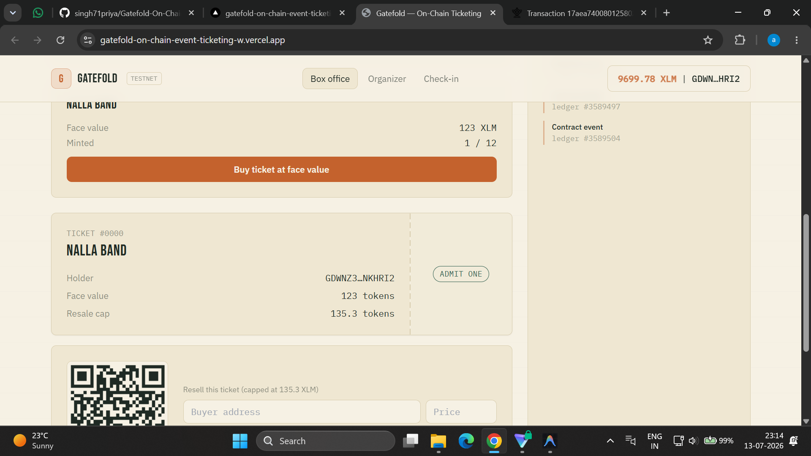
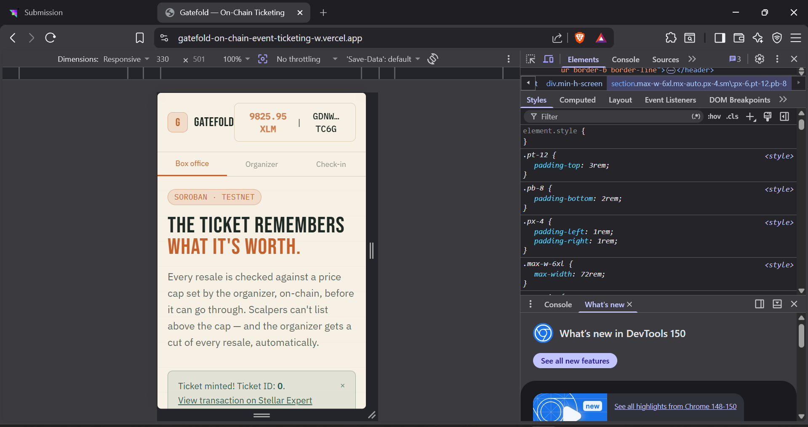
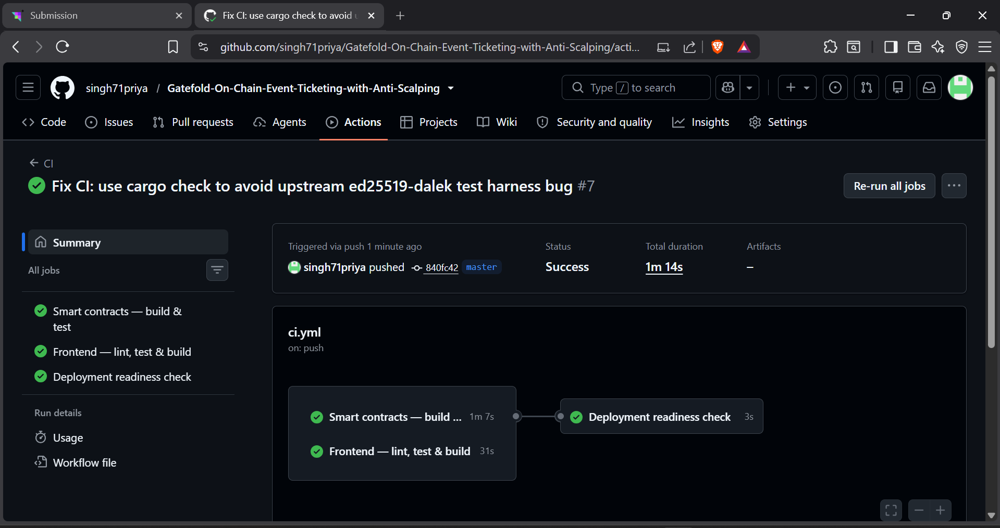
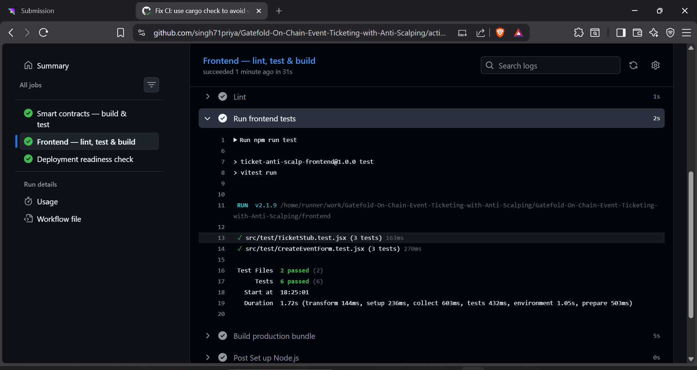

<div align="center">
  
# 🎟️ Gatefold - On-Chain Event Ticketing with Anti-Scalping

**A decentralized ticketing platform built on Stellar & Soroban smart contracts.**  
*Gatefold completely prevents scalping by enforcing maximum resale price caps and automated royalty payments to event organizers natively on-chain.*

[](https://stellar.org/soroban)
[](https://vitejs.dev/)
[](https://gatefold-on-chain-event-ticketing-w.vercel.app/)
[](https://drive.google.com/file/d/1UdzMM3J4gPRDqZPVe34DyGF73d3lRZPT/view?usp=sharing)

### 🔗 [▶️ Live App](https://gatefold-on-chain-event-ticketing-w.vercel.app/) &nbsp;|&nbsp; [🎥 Video Demo](https://drive.google.com/file/d/1UdzMM3J4gPRDqZPVe34DyGF73d3lRZPT/view?usp=sharing)

</div>

<br />

## 🌟 Key Features

1. **Un-Scalpable Tickets:** Organizers set a maximum resale percentage. Smart contracts physically prevent secondary sales above this price.
2. **Automated Royalties:** If a ticket is resold, the organizer's royalty percentage is mathematically calculated and transferred to them instantaneously in the same transaction.
3. **Cryptographic Check-in:** Door staff scan QR codes that are cryptographically verified by the smart contract, preventing counterfeit tickets and double-entries.
4. **Real-time Settlement:** Payments, ticket transfers, and royalties are settled on the Stellar network in 3-5 seconds with near-zero transaction fees.

---

## 🚀 Smart Contract Deployment (Stellar Testnet)

The smart contracts are live and deployed to the **Stellar Testnet** via automated CI/CD (GitHub Actions). All contract interactions use the native **XLM** token.

| Contract | Contract ID | Explorer |
|---|---|---|
| 🏭 **Factory** | `CAMDA6P4RNBY3YDYOSHE3XNMANM55I2LGW2U4DLJFLB3N6VKUFRPUQ3I` | [View on Stellar Expert](https://stellar.expert/explorer/testnet/contract/CAMDA6P4RNBY3YDYOSHE3XNMANM55I2LGW2U4DLJFLB3N6VKUFRPUQ3I) |
| 📋 **Registry** | `CD3X7LYOHFUVMLCIQYNSIIU6JOMHOSZDXMPRO46AO4BYQRGQ3EOKNDQU` | [View on Stellar Expert](https://stellar.expert/explorer/testnet/contract/CD3X7LYOHFUVMLCIQYNSIIU6JOMHOSZDXMPRO46AO4BYQRGQ3EOKNDQU) |
| 💰 **Token (XLM)** | `CDLZFC3SYJYDZT7K67VZ75HPJVIEUVNIXF47ZG2FB2RMQQVU2HHGCYSC` | [View on Stellar Expert](https://stellar.expert/explorer/testnet/contract/CDLZFC3SYJYDZT7K67VZ75HPJVIEUVNIXF47ZG2FB2RMQQVU2HHGCYSC) |

**Network:** Stellar Testnet (Test SDF Network ; September 2015)  
**RPC URL:** `https://soroban-testnet.stellar.org`  
**Horizon URL:** `https://horizon-testnet.stellar.org`  

### 🔗 Sample On-Chain Transactions

| Action | Transaction Hash | Explorer |
|---|---|---|
| 🎫 Ticket Minted | `69e38172597dc751b1a00faea2ef78c41f59fcc72aef0e292fee761e46a1c845` | [View](https://stellar.expert/explorer/testnet/tx/69e38172597dc751b1a00faea2ef78c41f59fcc72aef0e292fee761e46a1c845) |
| ✅ Check-in Verified | `ae7ccd92475777525a61c9398594fab5fdaa99bd48019369557d8899d954bb1c` | [View](https://stellar.expert/explorer/testnet/tx/ae7ccd92475777525a61c9398594fab5fdaa99bd48019369557d8899d954bb1c) |

> The contracts are automatically redeployed on every push to `master` via the [Deploy to Testnet](.github/workflows/deploy.yml) GitHub Actions workflow.

---

## 📸 Application Showcase

### 1. Product UI Overview



### 2. The Ticketing dApp (Mobile Responsive)



### 2. Automated Deployments (CI/CD)



### 3. Smart Contract Test Coverage



---

## 🛠️ Architecture

This project is split into three main components:

1. **Factory Contract (`contracts/factory/`)**
   - Mints NFTs (Event Tickets).
   - Serves as the central interface for buying and checking in.
2. **Registry Contract (`contracts/registry/`)**
   - The anti-scalping engine.
   - Enforces the price ceiling mathematically on every secondary sale.
   - Calculates the royalty split for the organizer.
3. **Frontend Application (`frontend/`)**
   - React + Vite Single Page Application.
   - Integrates with `@creit.tech/stellar-wallets-kit` for seamless wallet connectivity.

---

## 🚀 Quick Start (Local Development)

### Prerequisites
- Node.js (v18+)
- Rust (latest stable)
- Stellar CLI (`cargo install --locked stellar-cli`)

### Running the Frontend
```bash
cd frontend
npm install
npm run dev
```
